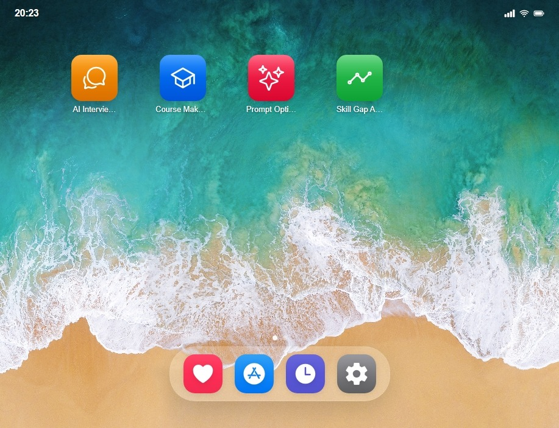

> A modern AI operating system built for the future.



---

## 🚀 Overview

AI OS is a cutting-edge platform that brings the power of artificial intelligence to your fingertips through an intuitive, mobile-first interface. Built from the ground up with a custom design system, it offers a seamless experience for discovering and running AI Apps.

## ✨ Features

| Feature | Description |
|---------|-------------|
| 🎨 **Custom UI System** | Sleek, modern interface with our proprietary design language |
| 🤖 **AI Apps** | Access and run powerful AI-powered applications |
| ⚡ **Lightweight** | No heavy frameworks - pure vanilla JavaScript |
| 📱 **Mobile Ready** | Fully responsive across all devices |
| 🔐 **Secure Auth** | User authentication with session management |
| ❤️ **Favorites** | Save and organize your most-used AI Apps |
| 📜 **History** | Track recently accessed AI Apps |
| ⚙️ **Settings** | Customize your AI OS experience |

## 🛠️ Tech Stack

- **Frontend**: HTML5, CSS3, JavaScript (ES6+)
- **Icons**: [Ionicons](https://ionic.io/ionicons)
- **Architecture**: Component-based modular design
- **Backend**: Cloud-hosted (see Architecture section)

## 📁 Repository Structure

```
ai-os/
├── index.html                  # Main application entry point
├── README.md                   # Documentation
├── LICENSE                     # Proprietary license
├── .gitignore                  # Git ignore rules
│
├── assets/
│   ├── css/
│   │   └── os.css              # Complete styling & design system
│   ├── js/
│   │   ├── config.js           # Application configuration
│   │   ├── utils.js            # Utility functions
│   │   ├── components.js       # Component loader
│   │   ├── api.js              # API client layer
│   │   └── os.js               # Main application logic
│   └── images/
│       ├── defaultwallpaper.jpg
│       └── defaultwallpaper-2.jpg
│
├── components/                 # Reusable UI components
│   ├── status-bar.html         # Status bar component
│   ├── dock.html               # Dock navigation
│   ├── app-window.html         # App window container
│   └── loading.html            # Loading overlay
│
└── screens/                    # Application screens
    ├── home.html               # Home screen with app grid
    ├── browse.html             # App store / browse screen
    ├── favorites.html          # Favorites screen
    ├── history.html            # History screen
    └── settings.html           # Settings screen
```

---

## 🏗️ Architecture

### Component-Based Design

AI OS uses a modular, component-based architecture:

- **Components** (`/components`) - Reusable UI elements
- **Screens** (`/screens`) - Full page layouts
- **Utilities** (`/assets/js/utils.js`) - Helper functions
- **Configuration** (`/assets/js/config.js`) - Centralized settings

### Why is the backend not included?

This repository contains the **frontend client** of AI OS. The backend infrastructure is hosted separately for the following reasons:

1. **Security** - Our backend contains proprietary AI processing logic, API integrations, and security mechanisms that must remain protected.

2. **Scalability** - The backend runs on cloud infrastructure optimized for AI workloads, which cannot be replicated in a simple repository.

3. **API Dependencies** - The system integrates with multiple third-party AI services that require secure credential management.

4. **Continuous Updates** - Our backend receives continuous updates and improvements that are deployed independently.

### How does it work?

The frontend connects to our **live cloud API** at `aios.hozting.in`. When you run this application:

1. Open `index.html` in a browser (or use a local server)
2. The app connects to our cloud backend
3. All AI processing happens server-side
4. Results are returned to the frontend in real-time

> This architecture demonstrates a production-ready, scalable approach to building AI applications. The separation of frontend and backend allows for independent scaling, security isolation, and rapid iteration.

---

## 🚦 Getting Started

### Quick Start

1. **Clone the repository**
   ```bash
   git clone https://github.com/yourusername/ai-os.git
   cd ai-os
   ```

2. **Run locally** (recommended)
   ```bash
   # Using npx
   npx serve .
   
   # Or Python
   python -m http.server 8000
   
   # Or PHP
   php -S localhost:8000
   ```

3. **Open in browser**
   ```
   http://localhost:8000
   ```

### Direct File Access

You can also open `index.html` directly in your browser, though some features may be limited due to CORS policies.

---

## 📋 Demonstration Information

This project is submitted as part of a demonstration. Key points:

- ✅ **Fully Functional** - Connects to live backend services
- ✅ **Production Ready** - Real users can interact with the system
- ✅ **Scalable Architecture** - Frontend/backend separation
- ✅ **Component-Based** - Modular, maintainable codebase
- ✅ **Modern Tech Stack** - No outdated dependencies
- ✅ **Mobile Responsive** - Works on all devices

---

## ⚖️ License & Copyright

**Copyright © 2026 RahulHackz/Raj Vardhan Rahul/AI OS/Sai Srujana. All Rights Reserved.**

This software is **proprietary**. See the [LICENSE](LICENSE) file for details.

### What you CAN do:
- ✅ View and run the application for evaluation
- ✅ Review the code
- ✅ Use the application to interact with AI OS services

### What you CANNOT do:
- ❌ Copy, modify, or redistribute the code
- ❌ Use any portion in your own projects
- ❌ Attempt to reverse engineer backend services
- ❌ Remove proprietary notices

---

## 📞 Contact

For inquiries about licensing, partnerships, or the backend infrastructure:

- **Email**: admin@rahulhackz.in
- **Website**: [https://aios.hozting.in](https://aios.hozting.in)

---

<div align="center">

**AI OS** - *Powering the Future of AI Apps with ease!*

Made with ❤️ and ☕

</div>
